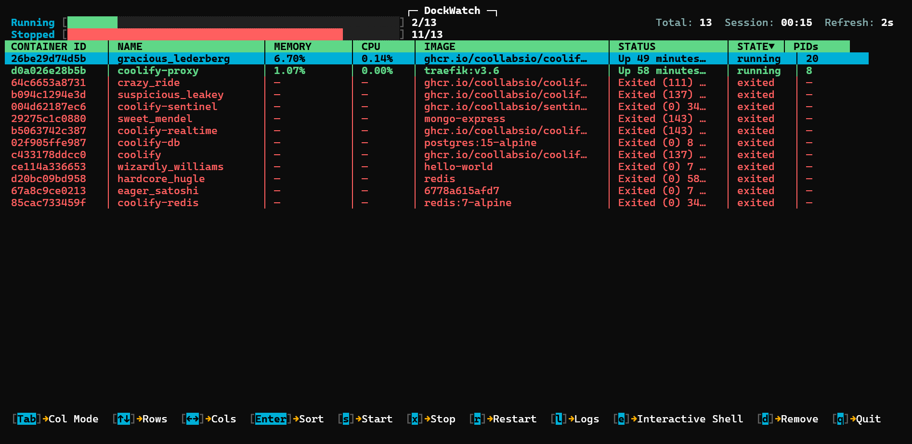

# Built a Docker TUI Container Manager while learning GO and Docker

**Published:** 2025-12-07  
**Tag:** Tech

Built a terminal-based Docker container manager in Go over a weekend

---

# Why I built [DockWatch](/work/dockwatch)?
While learning Docker, I got annoyed typing `docker ps` hundreds of times just to check container status. So I built **DockWatch** - an open-source terminal UI for managing Docker containers without repetitive commands.

I chose **Go** for its speed and lower resource usage compared to Python, plus it's perfect for CLI tools.

# What does [DockWatch](/work/dockwatch) actually do?

**DockWatch** lets you manage containers with a terminal-based interface:
- Press `S` to start a container
- Press `X` to stop it
- Press `L` to view logs
- Press `E` for interactive shell access
- Real-time CPU, memory, and PID stats

# Building [DockWatch](/work/dockwatch)
### Day 1: Learning Go and Setting Up

I quickly picked up Go basics since I already knew C - concepts like `StdoutPipe`, `NewScanner(stdout)`, and `cmd.Exec()` felt familiar.

I chose **Bubble Tea** as the TUI framework since it's popular and well-suited for this use case. Used AI to generate boilerplate code for the Bubble Tea setup so I could focus on the Docker integration logic.

## Day 2: Building Features

Built the core functionality:
- Container management (start/stop/restart)
- Real-time stats fetching (CPU, memory, PIDs)
- Log viewer
- Interactive shell access
- Auto-refresh every 2 seconds

### Challenges I faced
**Code organisation:** The app grew to 1000+ lines in one file, so I had to split it into multiple files (docker.go, model.go, keys.go).

**Understanding patterns:** As features grew, the backend got complex. Breaking down the logic flow into smaller chunks helped me understand how everything connected.

**Debugging:** Hard to debug when the TUI is actively rendering. Had to learn how to pause execution properly.

**Go syntax:** Some patterns were new to me, took time to get comfortable with pointers and interfaces.

## What I Learned

- Go syntax, patterns, and error handling
- Docker CLI with JSON formatting (`--format "{{json .}}"`)
- TUI development with Bubble Tea
- How to structure larger Go projects
- Debugging terminal applications

## Tech Stack

- **Go** - Core language
- **Bubble Tea** - TUI framework
- **Lip Gloss** - TUI styling
- **Docker CLI** - Container management

## What's Next

Planning to add:
- Network I/O stats
- Remote Docker host support
- Docker Compose integration
- Packaging for Linux distributions

Check it out on [GitHub](https://github.com/shubh-io/dockwatch) and let me know what you think!

