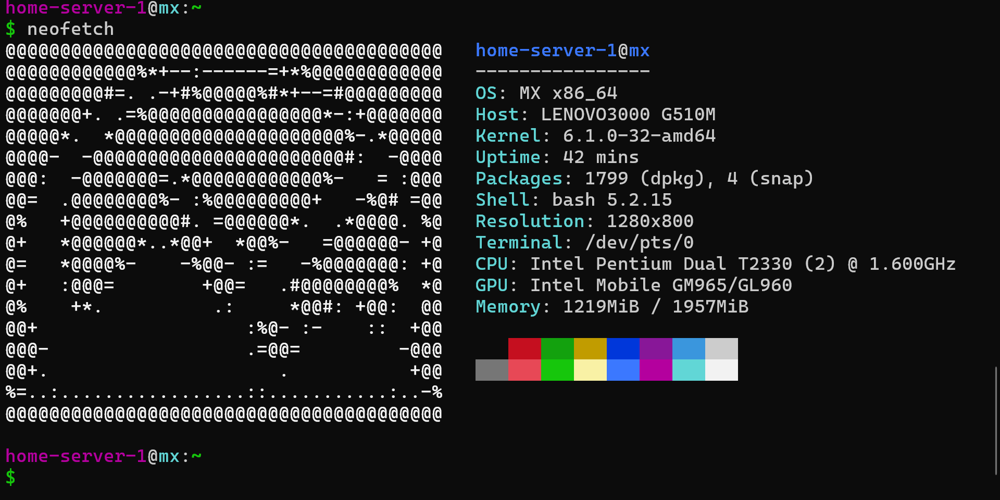

# Converting an Old Laptop Into a Self-Hosted Server

**Published:** 2025-12-01  
**Tag:** Tech

As title says

---

## I turned my old laptop into a self-hosted server for literally ***FREE***, and here's exactly how I did it.

**Spoiler: It didn't go as planned.**

First challenge I faced was choosing the ***right*** Operating System for the lightest load on hardware.

After **quite a bit of research**, I came down to *3 final linux distros* that were checking all my checkboxes:

- **AntiX Core** 
- **Debian 12 (Bookworm)**
- **Mx Fluxbox**

Let's look at my *laptop's config* first:



The *major challenge* I faced was with my Old Laptop's **Broadcom wifi chip** (BCM4311).

I tried **everything** to make the Wi-Fi driver work, but all failed. 

I tried to load up the `firmware-b43legacy-installer` package manually (without internet), it asked for *even more* core packages (like b43-fwcutter) to be installed as a prerequisite, and even the prerequisite packages have *MORE 
prerequisite*. 

It was an endless loop of installing & downloading packages manually since I didn't have internet access on that laptop. 

Ironically, even after shifting the Linux distro to *Mx Fluxbox* (which basically has all non-free firmwares already installed), **IT STILL DIDN'T WORK** because Wi-Fi modules were conflicting!

I wasted lots on time on solving this issue. Here's a light overview:

Installed **AntiX-Core** -> Packages issues -> Tried **Debian 11 with *non-free firmware*** installed distro -> Missing `firmware-b43` -> Tried **Mx-FluxBox** -> Had **`b43-firmware`** but conflicting with other modules -> *Modules couldn't be removed*

### The Solution? Give Up on Wi-Fi

**I gave up on Wi-Fi** and connected it to an Ethernet cable in the living room near the router. *Ironically*, even Ethernet **DIDN'T work** in *Debian 12*, but it worked in *Mx Fluxbox*.

After finally seeing some hope of internet connection, I updated and installed all packages:
```
sudo apt update
sudo apt upgrade
```
### Setting Up SSH

I tried to set up SSH
And another challenge came: ***Firewall***.

I fixed it with iptables (since that's what MX Linux supports by default). Flushed all firewall rules with:
```
sudo iptables -F
```

Temporarily allowed every port to accept requests and **IT WORKED!**

I finally connected to the old laptop's local IP using SSH and turned off the display:
```
sudo vbetool dpms off
```
This command signals the BIOS to turn off the display.

Now it's running **24/7** (except when the power is cut off)!


