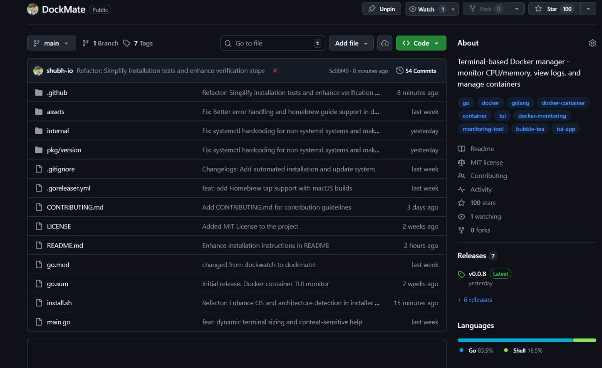

# Building DockMate: From 0 to 100 GitHub Stars in Two Weeks

Two weeks ago, I shipped [DockMate](https://github.com/shubh-io/dockmate), A terminal-based Docker manager built in Go.

Today, it hit **100 STARS** on GitHub.



Here's what I learned about open-source projects.

---

## Why I Built DockMate

While learning Docker, I found myself constantly typing `docker ps`, `docker logs`, `docker stop`, the repetition was annoying. I tried LazyDocker, but its interface felt slightly old and overly complex for my needs.

I wanted something minimal, fast, and modern looking.

**The tech stack:**
- **Go** - I had C experience, so Go's syntax felt familiar
- **Bubble Tea** - A TUI framework similar to Tkinter (which I'd used in [EyeWell](/work/eyewell))
- **Docker** - For container management

I spent a weekend building the MVP, shipped it, and posted to Reddit.

---

## The Launch Strategy

### r/docker: The Viral Start
**Results:** 34K views, 48 upvotes (85% ratio), 17 comments, 68 shares

This post hit #1 on r/docker and stayed there for hours. The community response was really incredible, developers with GitHub accounts from 2008-2012 were starring the repo.

**Key lesson:** Launch where your target users actually are, not where you *think* they might be!!

### r/sideproject: The Reality Check
**Results:** 200 views, 1 upvote

Total flop. The project was too niche for a general audience. I learned that not every community is your community.

### r/commandline: The Niche
**Results:** 7.9K views, 28 upvotes (94% ratio), 22 comments, 41 shares

Smaller audience, but highly engaged. These users litreally *live* in the terminal (lol), they gave detailed awesome feedback and feature requests.

### r/selfhosted:The Perfect Fit
**Results:** 35K views, 89 upvotes (96% ratio), 31 comments, 144 shares

This community somewhat became DockMate's home. They immediately understood the value, requested features (Docker Compose was #1), and actively shared the project.

**96% upvote ratio** = They *really* liked it.

### r/golang - Just Okayish
**Results:** 12K views, 25 upvotes (removed by mods)

Posted on day one, gained traction, but mods removed it for being promotional. 
Still got ~10-15 stars before removal.

**Lesson:** Read community rules carefully.

---

## The Numbers

**Total Reddit Performance:**
- **87K+ views** across 5 communities
- **190+ upvotes** (91% average ratio)
- **70+ comments** with real feedback
- **253+ shares** (organic viral spread)

**Conversion:**
- 87K views -> 100 stars = **0.11% conversion**
- 190 upvotes -> 100 stars = **53% conversion**

Turns out, most people browse but don't star. That's normal.

Most conversions were from -> r/commandline
---

## What Actually Worked

### 1. Ship Fast, Iterate Faster
I didn't wait for perfection. 

I shipped an MVP in 2 days, then fixed bugs based on real user feedback.

**Example:** A user reported "Not using full screen for container list" bug. I debugged my application, and I shipped the release within hours. 

User replied with a ❤️ emoji.

**That reaction >>> 1000 stars.**

### 2. Make Installation Frictionless
```
curl -fsSL https://... | sh
```

One command. No dependencies. Works on Linux and macOS.

Then I added Homebrew support:
```
brew install shubh-io/tap/dockmate
```


### 3. Respond to Every Issue and Feedbacks Immediately
Within 2 weeks, I:
- Shipped 8 releases (v0.0.1 → v0.0.8)
- Fixed installation bugs
- Added Homebrew detection
- Optimized container loading (20s → 2s)

Fast iteration builds trust.

### 4. Community > Features
Docker Compose was the #1 requested feature across all communities. Instead of rushing it, I:
- Explained my current focus (stability)
- Set no timeline
- Invited users to star the repo for updates

**Being honest > overpromising.**

---

## What I Learned

### **Launching is easier than maintaining.**

Getting to 100 stars took 11 days.

Getting to 200 will require consistent maintenance, bug fixes, and feature development.

### **Your target niche matters.**

Always promote your application where **YOUR** target users actually hang out.

### **Your best users give feedback.**

The 70+ comments weren't just praise, they were feature requests - bug reports, feature request, and architecture suggestions. That's gold.

### **Comparison is inevitable.**

Every post had "How is this different from LazyDocker?" comments. I learned to answer once for all by adding a comparison table in README.md.

---


## Final Thoughts

Building DockMate taught me that shipping something *real* beats theorizing about perfect code. The community will tell you what matters.

100 stars in 11 days still feels **unreal**.

But what matters more are the people who cared enough to give feedbacks, raised issues and feature requests - the user who debugged dockmate update issues with me, and the senior developers (with 15+ year old accounts) who found my application useful.

**If you're building something, SHIP the MVP asap. The feedback is worth more than the stars.**

⭐ [Star DockMate on GitHub](https://github.com/shubh-io/dockmate)

---

**Built by [@shubh-io](https://github.com/shubh-io)**  
**Stack:** Go • Bubble Tea • Docker SDK  
**Read more:** [Project README](https://github.com/shubh-io/dockmate?tab=readme-ov-file#dockmate-)
```


