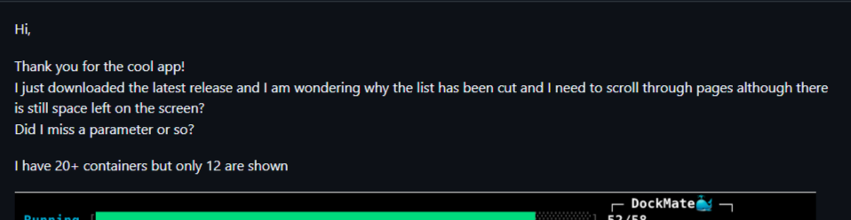
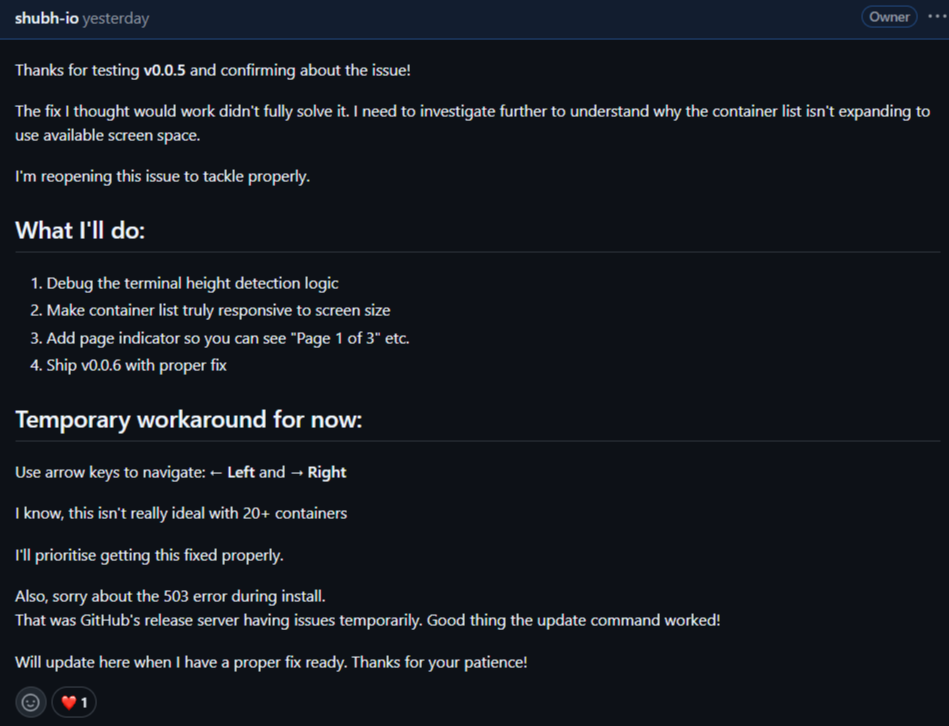
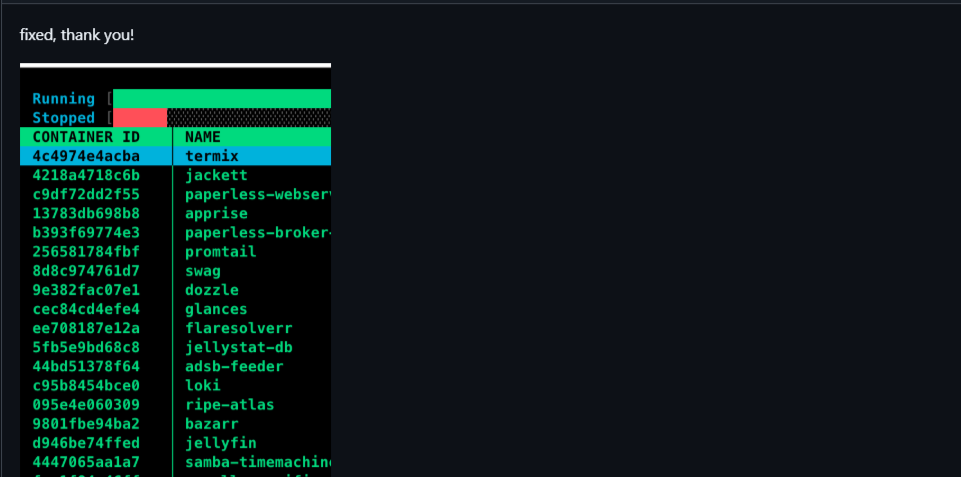

# Why Shipping Fast Beats Shipping Perfect

I learnt why **shipping fast** matters far more than shipping perfect.

For context, I maintain an *open-source* Docker TUI project called [DockMate](https://github.com/shubh-io/dockmate). 

Two days ago, I shipped two releases (v0.0.4 and v0.0.5) without proper testing or debugging, and bugs showed up immediately.

## The Bug

A user reported that only 12 containers were visible when 20 or more could fit on their screen. My dynamic sizing logic was **broken**.

I immediately replied, acknowledging the issue and prioritising the fix as my top concern, and got to work.

## The Fix

I began debugging and shipped v0.0.6 just **2 hours later**. 

The user's response? **"fixed, thank you."**

This experience was **FAR better** than getting **100 stars** on my repo.

## What I Learned

- **Speed beats perfection**: A 2-hour fix earned more trust than perfect code would have
- **Users care about responsiveness**: "Fixed, thank you" > 100 silent stars  
- **Real feedback > metrics**: One bug report taught me more than GitHub analytics
- **The loop that matters**: Ship -> Get feedback -> Improve -> Repeat

That single interaction taught me **more** about building useful software than any tutorial ever did.

